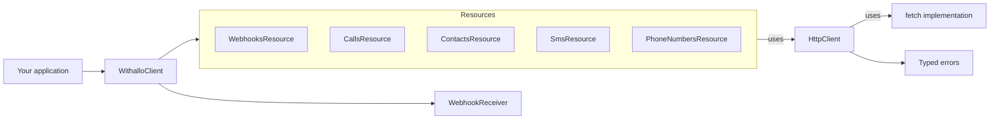
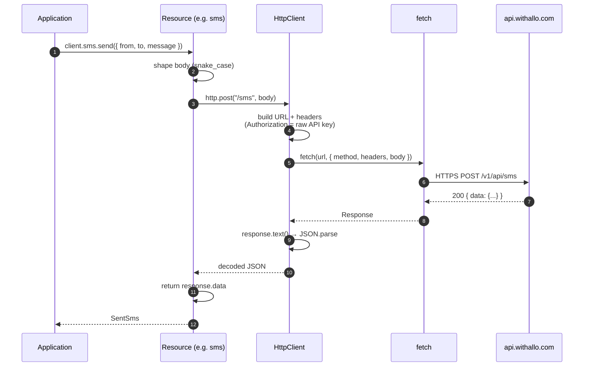
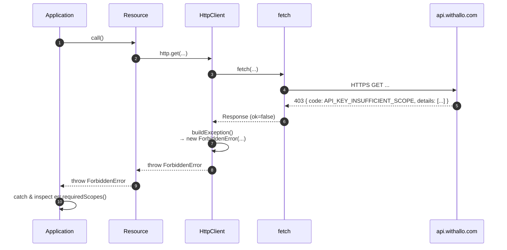
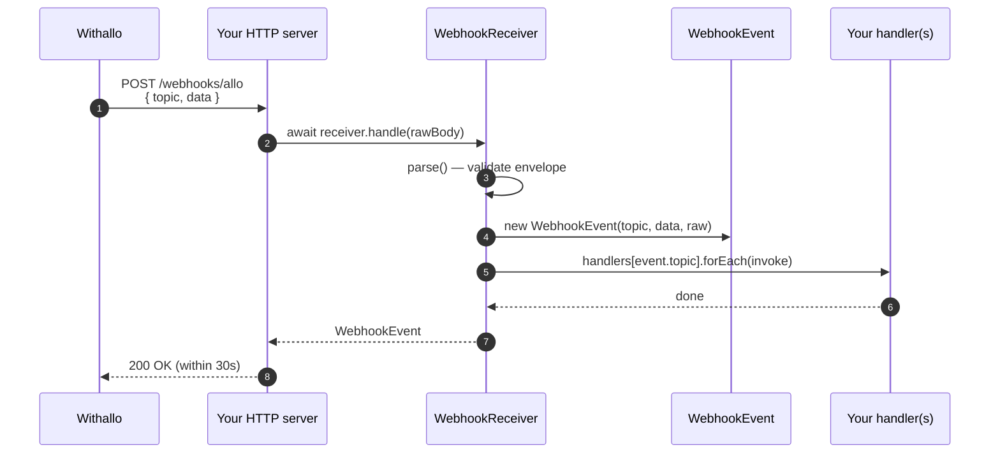
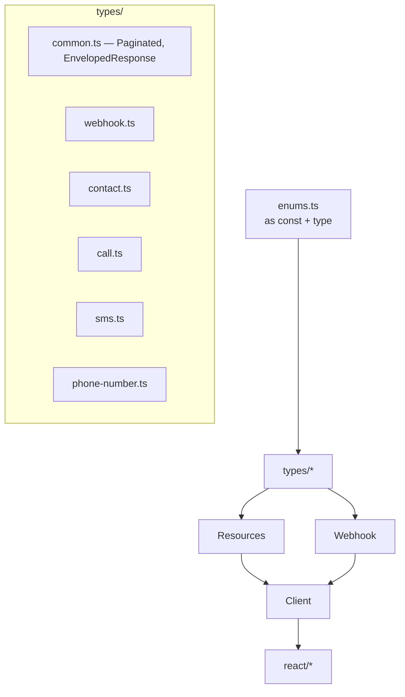

# Architecture — `@qrcommunication/withallo-sdk`

This document describes the architecture of the TypeScript SDK in depth. For a task-oriented quick start, see the root [README](../README.md). For the raw Withallo API contract, see [openapi.yaml](./openapi.yaml).

## High-level layers



Key properties:

- **`WithalloClient`** is the public entry point. Constructing it builds exactly one `WithalloConfig`, one `HttpClient`, and one instance of each resource. Resources share the same `HttpClient` through constructor injection.
- **Resources** are thin adapters that know *which* path / verb to call and *how* to shape the request/response; they contain **no network logic**.
- **`HttpClient`** is the single place where `fetch` is invoked, headers are set, and HTTP error codes are translated into typed exceptions.
- **`WebhookReceiver`** is stateless and independent of `HttpClient` — parsing and dispatching incoming payloads does not need the network.
- **React hooks** (under `./react`) wrap `WithalloClient` via the `WithalloContext` and expose `{ run, data, error, isPending }` ergonomics.

## Request lifecycle (outbound REST call)



Error path (e.g. 403):



## Incoming webhook pipeline



Failures in `parse()` throw `InvalidWebhookPayloadError` (missing `topic`, unknown topic, malformed JSON, empty body). Your HTTP handler should map that to a 400 so Withallo can see something is wrong.

## Module boundaries

```
src/
├── client.ts          — WithalloClient (public)
├── config.ts          — WithalloConfig
├── http.ts            — HttpClient (shared by all resources)
├── errors.ts          — WithalloError + subclasses
├── enums.ts           — as const objects + derived types
├── resources/
│   ├── webhooks.ts
│   ├── calls.ts
│   ├── contacts.ts
│   ├── sms.ts
│   └── phone-numbers.ts
├── webhook/
│   ├── event.ts       — WebhookEvent (immutable value object)
│   └── receiver.ts    — WebhookReceiver (parse + dispatch)
├── types/             — wire-level TypeScript types
└── react/
    ├── context.ts     — WithalloContext + useWithallo
    ├── provider.tsx   — <WithalloProvider>
    ├── use-async-action.ts — base hook (internal)
    ├── use-send-sms.ts
    ├── use-webhooks.ts
    └── index.ts       — public re-exports
```

### Where the boundaries are enforced

| Layer | Depends on | Forbidden imports |
|-------|------------|-------------------|
| `resources/*` | `http.ts`, `types/*`, `enums.ts` | `client.ts`, `react/*` |
| `http.ts` | `config.ts`, `errors.ts` | any resource |
| `webhook/*` | `enums.ts`, `errors.ts` | `http.ts`, any resource |
| `react/*` | `client.ts`, `types/*`, `enums.ts` | none (outside) |

The consequence: you can use `WebhookReceiver` in a project that doesn't need the API at all (e.g. a serverless function that only receives events), and you can pull the React layer into a tree-shaken bundle without dragging the React code into a Node-only script.

## Type architecture



- Enums are `as const` objects with a same-named type alias (so they act like TypeScript enums at the type level but avoid runtime enum objects).
- Types never import from `resources/` or `client.ts` — they are the leaves of the graph.
- Every resource method's return type references a type from `types/`, not an anonymous shape.

## Extension points

| Use case | Knob |
|----------|------|
| Polyfill / swap `fetch` | `new WithalloClient({ fetch: customFetch })` |
| Replace the whole HTTP layer | `new WithalloClient({ httpClient: new MyCustomHttp(config) })` |
| Inject a custom user agent | `userAgent: "my-app/1.2.3"` in `WithalloClientOptions` |
| Mock for tests | `tests/support/mock-fetch.ts` — wraps `vi.fn()` over `fetch` |
| Custom React state lib (e.g. TanStack Query) | Do NOT use our hooks — call `client.*` directly from your own query |

## Bundling and distribution

- **Build tool**: [`tsup`](https://tsup.egoist.dev/) (dual entry: `.` and `./react`).
- **Formats**: ESM (`.js`), CJS (`.cjs`), and matching `.d.ts` / `.d.cts` for both.
- **Sourcemaps**: shipped.
- **Tree-shaking**: `"sideEffects": false` in `package.json`.
- **Typical sizes** (v0.1.x): core ≈ 16 KB minified, React ≈ 19 KB minified.
- **Target**: ES2022 — no polyfills shipped. Supports Node 18+, modern browsers, Deno, React Native, Bun, edge runtimes.

## Testing strategy

- **Unit scope**: Vitest runs each resource test against a mocked `fetch` via `tests/support/mock-fetch.ts` — no network, deterministic assertions on the *outgoing* request (URL, method, body, headers) and on how responses are consumed.
- **React scope**: `@testing-library/react` + `happy-dom` environment. Hooks are rendered through `<WithalloProvider options={{ apiKey: "k", fetch: mock.fetch }}>` so the same mock harness is reused.
- **What is NOT tested here**: the Withallo API itself. A small integration script (see `docs/examples/live-smoke-test.ts`) can be run against a real key to validate end-to-end.

## Security model

| Concern | Mitigation |
|---------|------------|
| API key leakage | Raw key lives only in server-side envs. Never use `NEXT_PUBLIC_*` or inline in a client bundle. |
| Webhook spoofing | Withallo does not ship an HMAC today. Use a secret URL path + `allo_number` whitelist from `phoneNumbers.list()`. A `verifySignature()` method will be added non-breaking once a scheme is published. |
| Dependency vulnerabilities | Zero runtime dependencies. Dev deps tracked via Dependabot on the repo. |
| Typo-squatted imports | Package is scoped (`@qrcommunication/*`). Always install from the official scope. |
